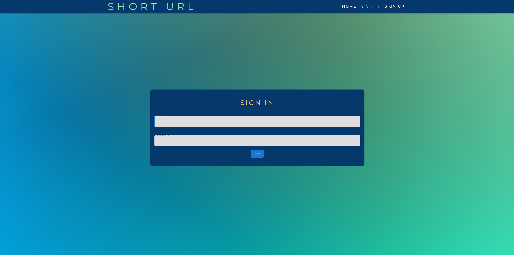

# Short URL

## Description

Welcome to Short URL, an innovative platform designed to simplify and optimize your web browsing experience. Short URL enables users to efficiently shorten long URLs for easier sharing and management. The intuitive interface offers both custom and automated short URL generation, enhancing user convenience and web navigation efficiency.

To visit Short URL and simplify your web experience, click [here.](https://short-url50-ca670a86f511.herokuapp.com/)

## Table of Contents

  - [Installation](#installation)
  - [Usage](#usage)
  - [Mock-Up](#mock-up)
  - [License](#license)
  - [Contributing](#contributing)
  - [Future Development Goals](#future-development-goals)

## Installation

- Requires Node.js and dependencies specified in the `package.json` file.
- Clone the repository to your local machine.
- Install the necessary dependencies using the command `npm i`.

## Usage

Follow these steps to utilize the Short URL platform effectively:

##### Home Page

- The Home page is accessible upon logging in. First-time users need to sign up.
- Enter the original URL you wish to shorten. Optionally, specify a custom URL path.
- View your three most recent short URLs, listed in descending order from newest to oldest.

##### User Authentication

- First-time visitors can create an account via the "Sign Up" page, providing a username, email, and password
- After signing up, you will be redirected to the "Sign In" page to log in with your credentials.

##### Profile Page

- Accessible after logging in, the Profile page features a built-in URL shortener for convenience.
- Manage and delete your previously shortened URLs, Deletion is permanent, and the short URL path becomes reusable.
- Permanently delete your account, which also disables and deletes all associated short URLs, freeing them up for future use.

##### Navigation

- Seamlessly navigate between the Home and Profile pages using the navigation bar.
- Log out at any time. You will be redirected to the "Sign In" page.

## Mock-Up

The following images show the web application's user interface and functionality.

##### Sign Up

##### Sign In

##### Home

##### Profile

##### Delete Short URL

##### Delete Account

## License

MIT License

## Contributing

Short URL is an ongoing solo project, and while it's primarily managed by me, I welcome any questions, feedback, or suggestions for improvement. If you're interested in discussing the project or have any queries, feel free to connect with me via [LinkedIn](https://www.linkedin.com/in/peterrichards57/). Your insights and perspectives are valuable in continually enhancing this application.

## Future Development Goals

Short URL is not just a demonstration of my technical skills but a tool with practical applications. With a commitment to continuous improvement and innovation, the following developments are on the horizon:

##### Domain Acquisition:
Plans are in place to acquire a dedicated short domain, aligning with the core purpose of Short URL and enhancing its real-world usability.
##### Account Management Enhancements:
Introducing features for users to update their account information, including username, email, and password, ensuring a more personalized and secure experience
##### Enhanced Security:
Implementing a 'Forgot Password' feature, enabling users to securely reset their passwords and maintain account access.
##### Progressive Web App (PWA) Transition:
Converting Short URL into a PWA to provide offline access to data, thereby improving accessibility and user convenience.
##### Mobile Usability:
Refactoring the application using React Native, targeting enhanced mobile user experience and interface responsiveness.